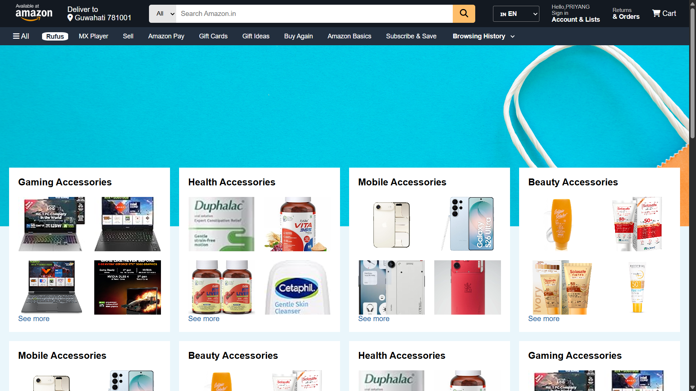
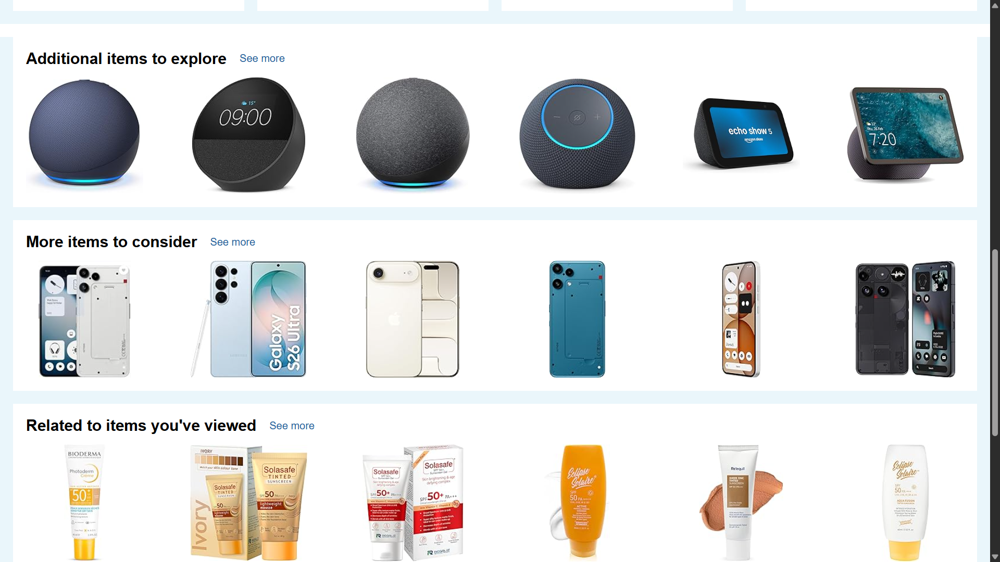
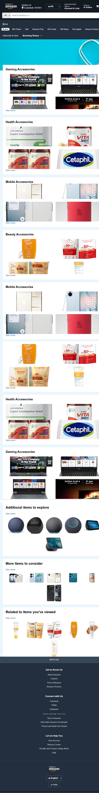

# 🛒 Amazon Clone

A responsive clone of the Amazon homepage built using **HTML5** and **CSS3**.

This project was created as part of my **Web Development** learning journey to practice building real-world website layouts, responsive design, Flexbox, CSS Grid, and reusable UI components.

---

## 📸 Screenshots

### 🏠 Home Page



---

### 🛍️ Product Section



---

### 📱 Responsive View



---

## ✨ Features

- Responsive Design
- Amazon-inspired Navigation Bar
- Search Bar
- Hero Banner
- Product Categories
- Product Cards
- Hover Effects
- Responsive Grid Layout
- Footer Section
- Mobile-Friendly Interface
- Clean and Organized Code

---

## 🛠️ Technologies Used

- HTML5
- CSS3
- Flexbox
- CSS Grid
- Media Queries
- Font Awesome
- Git
- GitHub

---

## 📁 Folder Structure

```text
Web-Development/
│
├── Amazon-Clone/
│   ├── index.html
│   ├── CSS/
│   │   ├── style.css
│   │   └── media-queries.css
│   ├── images/
│   ├── screenshots/
│   │   ├── homepage.png
│   │   ├── products.png
│   │   └── responsive-mobile.png
│   └── README.md
│
└── Portfolio-Website/
```

---

## 🚀 Getting Started

### 1. Clone the repository

```bash
git clone https://github.com/priyang-loq/Web-Development.git
```

### 2. Navigate to the project folder

```bash
cd Web-Development/Amazon-Clone
```

### 3. Open the project

Open `index.html` in your preferred web browser.

No additional setup or dependencies are required.

---

## 📚 What I Learned

Through this project, I gained hands-on experience with:

- Writing semantic HTML5
- Building responsive layouts using Flexbox and CSS Grid
- Designing an Amazon-inspired user interface
- Creating reusable components
- Implementing responsive design with Media Queries
- Organizing project files effectively
- Using Git and GitHub for version control

---

## 🎯 Future Improvements

- Add JavaScript functionality
- Functional Search Bar
- Image Slider / Carousel
- Shopping Cart
- Product Detail Pages
- Login & Signup Pages
- Dark Mode
- Backend Integration
- API-based Product Data

---

## 📖 Purpose

The goal of this project is to strengthen my frontend development skills by recreating the layout of a popular e-commerce website. It focuses on improving HTML, CSS, responsive design, and UI development through hands-on practice.

---

## 👨‍💻 Author

**Priyangshu Das**

**Computer Science Engineering Student**  
Frontend Developer (Learning)

**GitHub:** https://github.com/priyang-loq

---

## ⭐ Show Your Support

If you like this project, consider giving it a **⭐ Star** on GitHub!

---

## 📄 License

This project is created for educational and learning purposes only. It is **not affiliated with or endorsed by Amazon**.