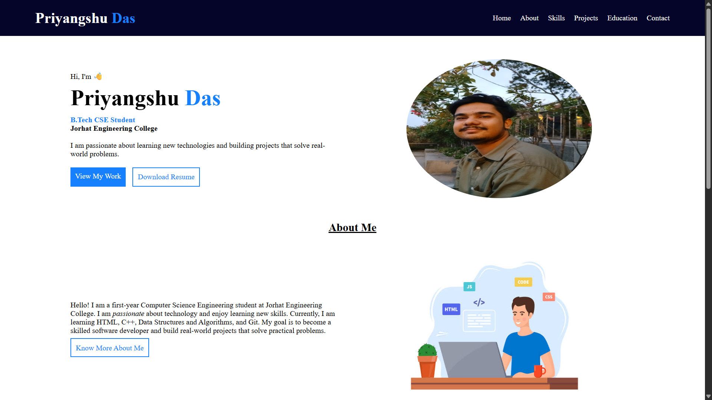
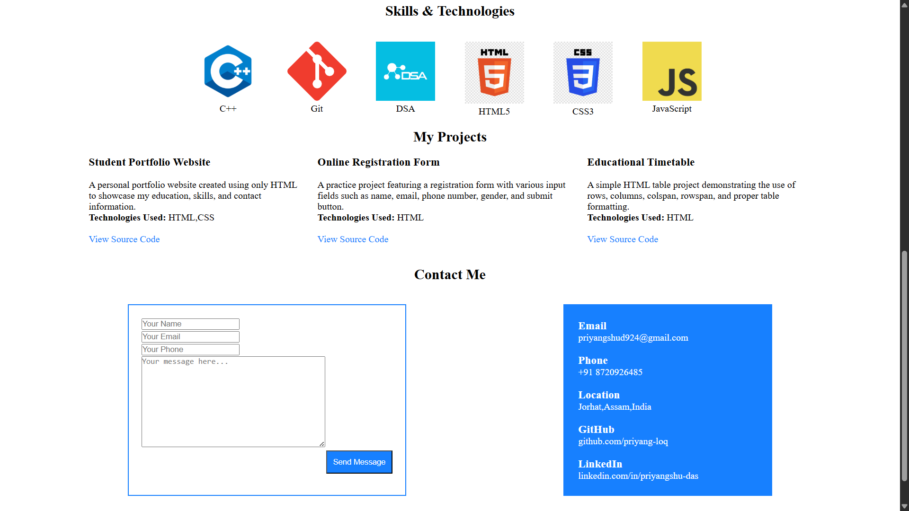
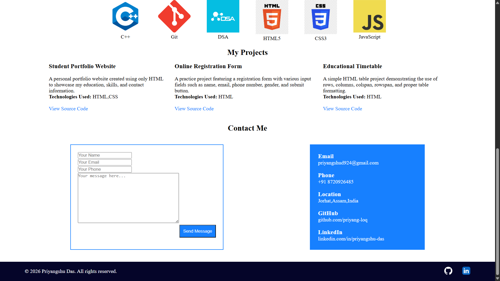

# 💼 Personal Portfolio Website

A responsive personal portfolio website built using **HTML5** and **CSS3** to showcase my profile, skills, education, projects, and contact information.

This project is part of my Web Development learning journey, where I practice building real-world responsive websites using modern frontend development techniques.

---

## 📸 Screenshots

### 🏠 Home Page



---

### 💡 Skills Section



---

### 📞 Contact & Footer



---

## ✨ Features

- Responsive Design
- Semantic HTML5 Structure
- Modern and Clean UI
- About Me Section
- Skills Section
- Education Section
- Projects Showcase
- Contact Section
- Social Media Links
- Flexbox & CSS Grid Layout
- Mobile-Friendly Interface
- Easy to Customize

---

## 🛠️ Technologies Used

- HTML5
- CSS3
- Flexbox
- CSS Grid
- Media Queries
- Git
- GitHub

---

## 📁 Folder Structure

```text
Portfolio-Website/
│
├── index.html
├── css/
│   ├── style.css
│
├── images/
│
├── screenshots/
│   ├── hero.png
│   ├── skills.png
│   └── contactme-footer.png
│
└── README.md
```

---

## 🚀 Getting Started

1. Clone the repository

```bash
git clone https://github.com/priyang-loq/Web-Development.git
```

2. Navigate to the project folder.

```bash
cd Web-Development/Portfolio-Website
```

3. Open `index.html` in your preferred web browser.

No additional setup or dependencies are required.

---

## 📚 What I Learned

Through this project, I gained hands-on experience with:

- Writing semantic HTML5
- Building responsive web pages
- Creating layouts using Flexbox and CSS Grid
- Organizing CSS files efficiently
- Designing modern user interfaces
- Improving website responsiveness with Media Queries
- Managing projects using Git and GitHub

---

## 🎯 Future Improvements

- Add JavaScript animations
- Dark Mode
- Download Resume Feature
- Contact Form with Backend Integration
- Project Filtering
- Smooth Scrolling
- Improved Accessibility
- Performance Optimization

---

## 📖 Purpose

The goal of this project is to strengthen my frontend development skills by building a fully responsive portfolio website from scratch. It also serves as my personal portfolio to showcase my learning journey and projects.

---

## 👨‍💻 Author

**Priyangshu Das**

**Computer Science Engineering Student**  
Frontend Developer (Learning)

**GitHub:** https://github.com/priyang-loq

---

## ⭐ Show Your Support

If you like this project, consider giving it a **⭐ Star** on GitHub!

---

## 📄 License

This project is created for learning and personal portfolio purposes.